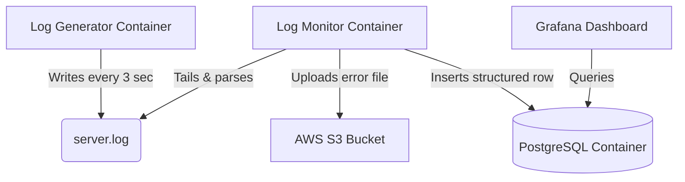

# Cloud-Native Log Observability & Analytics
[](https://www.docker.com/)
[](https://aws.amazon.com/s3/)
[](https://www.postgresql.org/)
[](https://grafana.com/)
[](https://www.python.org/)

## Overview

This is a project I built to understand how real production systems handle logs. I built a working log monitoring system on AWS - starting with basic scripts and evolving it into a fully containerized cloud-native stack.

The system runs 24/7 on AWS EC2 and automatically:
- Generates fake server logs 
- Detects ERROR events in real-time
- Backs up error logs to AWS S3
- Stores structured error data in PostgreSQL
- Visualizes everything on a live Grafana dashboard

## How it's built

I built this step by step, each one solving a problem I hit in the previous.

**1. Scripting and Automation**
Started by writing a Python script that generates logs continuously. Then I realized — what if the process dies? What if the server reboots? So I wrote `auto_restart.sh` to monitor and revive the process, and used cron to make it survive reboots. Also wrote `log_rotate.sh` to rotate logs daily and delete archives older than 7 days so the disk doesn't fill up.

**2. Docker**

Moved everything into Docker containers. One line — `restart: always` — replaced all my restart and reboot scripts. Used Docker volumes so logs persist even if containers die. Wrote a `docker-compose.yml` to manage both containers together.

**3. AWS S3**

Added AWS S3 as a backup layer. Every time the monitor detects an ERROR, it uploads a timestamped file to S3 automatically. Used IAM roles for authentication.

**4. PostgreSQL**

S3 is great for backup but it was not good for querying the data. So added PostgreSQL so every error gets stored as a structured row with timestamp, error type, and message. Used parameterized queries to prevent SQL injection. Now I can query things like "how many errors happened in the last hour?" etc.

**5. Grafana**

Connected Grafana to PostgreSQL to visualize the error data as a live time-series graph. You can see the heartbeat of the application in real time.

## Architecture



## Tech Stack

| Category | Tools |
|----------|-------|
| Languages | Python, Bash |
| Containers | Docker, Docker Compose |
| Cloud | AWS EC2, AWS S3, AWS IAM |
| Database | PostgreSQL |
| Monitoring | Grafana |
| Version Control | Git, GitHub |

## Project Structure

```text
cloud-log-observability
├── log_generator.py      # Simulates a server — writes INFO and ERROR logs
├── log_monitor.py        # Watches logs, uploads errors to S3 + PostgreSQL
├── log_rotate.sh         # Rotates server.log daily, deletes archives > 7 days
├── auto_restart.sh       # Restarts generator if it dies (no longer used)
├── Dockerfile            # Builds the container image
├── docker-compose.yml    # Runs all containers together
└── crontab_backup.txt    # Backup of the cron configuration used in Phase 1
```
