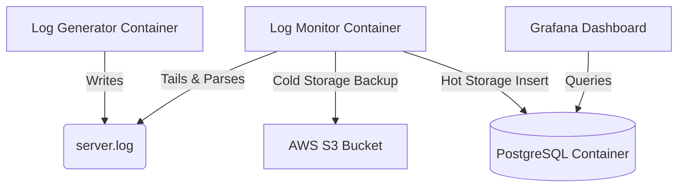

# Cloud-Native Log Observability & Analytics

## Overview
A production-grade, cloud-native log monitoring system built on AWS EC2 that automatically generates, detects, stores, and visualizes server logs in real-time. This project mimics enterprise-level data architecture, transitioning raw system text into actionable visual dashboards.

## System Architecture

## Tech Stack

| Technology | Purpose |
|------------|---------|
| **Python** | Log generation + monitoring |
| **Bash & Cron** | Linux automation scripts |
| **Docker Compose** | Containerization + orchestration |
| **AWS EC2** | Cloud compute server |
| **AWS S3** | Error log backup (cold storage) |
| **AWS IAM** | Secure role-based access |
| **PostgreSQL** | Structured log storage (hot storage) |
| **Grafana** | Real-time visualization dashboard |

## How It Works (The Pipeline)

### 1. Linux Automation & Generation
* `log_generator.py` simulates a live production server by generating traffic and intermittent errors.
* Automated via Bash (`auto_restart.sh`) and Linux Cron to survive server reboots and manage log rotation to prevent storage overflow.

### 2. Dual-Storage Routing
* A Python watchdog tails the live server logs to detect critical ERROR states.
* **Cold Storage (Disaster Recovery):** Boto3 authenticates automatically via IAM roles (zero hardcoded credentials) to bundle and upload raw error files to **AWS S3**.
* **Hot Storage (Analytics):** Parses log strings and securely inserts them into **PostgreSQL** using parameterized queries to prevent SQL injection.

### 3. Container Orchestration & Visualization
* The entire environment is containerized using Docker Compose for seamless networking and self-healing (`restart: always` policies).
* **Grafana** connects directly to the PostgreSQL container via the private Docker network. Time-series queries group errors by minute to populate a live visualization dashboard.

